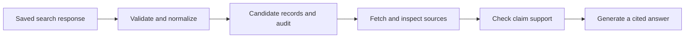

# From search results to traceable evidence: building the boundary before the model

*Ikechukwu Charles Okoli · Technical research portfolio · 12 September 2026*

An AI research workflow can lose the evidence behind an answer before a language model sees it. A common starting point is to take every search-result snippet, join the strings, and pass the resulting paragraph to a model.

That operation is easy to implement. It also discards information needed to explain an answer later: which query returned the text, which result supplied it, whether two entries point to the same URL, and whether a missing field means an empty search or an unexpected response.

This article implements the boundary between a search response and a set of traceable source candidates. The adapter consumes SearchApi-shaped JSON, preserves provenance, records exclusions, and makes no claim that accepting a candidate verifies its contents.

On the published fixture, **15 input rows produce six candidates, two duplicate occurrences, and seven rejected rows**. Those are deterministic results from authored test data. They describe the adapter's behavior, not SearchApi's production data quality.

[Inspect the adapter](../src/evidence.py), [read the fixtures](../data/evidence_cases.json), and [follow every disposition](../results/evidence-2026-09-12/candidates.json).

## Begin with the response contract

SearchApi's Google API documents organic results containing fields such as `position`, `title`, `link`, and `snippet`. Its example response also includes search parameters and response metadata. These provide useful material for an evidence record, although an application should validate the fields it consumes. [Source: Google Search API documentation](https://www.searchapi.io/docs/google).

The first temptation is:

```python
snippets = [row["snippet"] for row in response["organic_results"]]
context = "\n".join(snippets)
```

This code fails when a snippet is missing. More subtly, successful execution gives no assurance that the snippets are distinct, complete, relevant, or true. The output also makes it difficult to attach an answer back to its source.

The adapter instead returns a structured result:

```text
state
candidates[]
    id, url, title, snippet
    content_kind, trust, claim_verified
    provenance
    occurrences[]
audit[]
```

That format separates three questions: did the response match the expected shape, which source candidates survived validation, and what happened to each input row?

## An empty array and an absent field tell different stories

Using `response.get("organic_results", [])` is convenient, but it collapses two states. An explicitly empty list can be a legitimate result for a search. An absent field might mean a response with other search features, a different engine, an upstream error, or a changed schema.

The code therefore distinguishes:

| State | What the adapter observed |
|---|---|
| `empty` | The organic-result list exists and is empty |
| `missing_organic_results` | The expected field is absent |
| `schema_error` | The root or organic-result field has the wrong type |
| `provider_error` | The payload contains a nonempty error value |
| `no_usable_candidates` | Rows exist, but every row fails the candidate contract |
| `ok` | At least one candidate survives |

These are observations, not complete diagnoses. For example, `missing_organic_results` does not prove a provider defect. A caller should retain the response for inspection and decide whether other result types satisfy the task.

Treating every one of these states as “no results” would make both monitoring and debugging less informative. A workflow could silently continue with empty context when its response contract has actually changed.

## Normalize URLs conservatively

Duplicate detection creates a tradeoff: overly weak normalization retains redundant sources; overly aggressive normalization can merge distinct ones.

Consider:

```text
https://example.org/guide?edition=1#intro
HTTPS://EXAMPLE.ORG:443/guide?edition=1#intro
https://example.org/guide?edition=2#intro
https://example.org/guide?edition=1#limits
```

The first pair normalizes to the same key. The other two remain separate because the query value and fragment carry distinctions that this adapter cannot safely discard.

The implementation lowercases the scheme and host, normalizes internationalized hostnames, and removes a default port. It preserves path case, trailing slashes, query parameters, query order, and fragments. It does not strip tracking parameters by guessing, upgrade HTTP to HTTPS, follow redirects, or infer canonical-page relationships.

Keeping fragments can retain two candidates from one underlying page. That is intentional: an anchor may identify a section needed for a citation. An application measuring distinct documents should define a separate document identity and validate any broader equivalence rules against its sources.

URL splitting itself does not validate a URL. Python's documentation explicitly warns that the parsing functions can accept unusual inputs without rejecting them. The adapter therefore adds checks for supported schemes, a plausible hostname, port validity, whitespace, and embedded credentials. [Source: urllib.parse security guidance](https://docs.python.org/3/library/urllib.parse.html#url-parsing-security).

These checks are still not a secure web-fetching boundary. The adapter does not resolve DNS or request any destination. A future fetcher would need its own network policy, including destination checks after redirects and protection against access to internal addresses.

## Preserve the original occurrence

When two entries normalize to the same URL, the adapter keeps the first as the representative and attaches the second occurrence to it. Each occurrence records the input index, original position, and raw link.

The first entry's title and snippet remain the representative text. This avoids inventing a combined snippet, but it also means a later duplicate with a richer snippet does not automatically replace an earlier one. The original snapshot remains necessary for recovering all row content.

A candidate's identifier is the SHA-256 hash of its normalized URL. That identifies the URL, not a timeless piece of evidence. The same URL may have changed between searches, so an evidence-version key should combine the candidate identifier with its snapshot hash.

For the fixture run, provenance contains the fixture identifier, a clearly synthetic query label, and the fixture file's checksum. It leaves retrieval time null because no live search happened. For a saved response, the companion [snapshot command](../src/normalize_snapshot.py) carries through provider metadata and search parameters alongside a hash of the input bytes.

A checksum establishes which bytes were processed. It does not establish that those bytes were complete or truthful.

## Keep snippets below the trust boundary

The mixed fixture includes an instruction-like snippet. The adapter retains the string as data and labels every accepted candidate:

```json
{
  "content_kind": "search_snippet",
  "trust": "untrusted",
  "claim_verified": false
}
```

Those labels are useful metadata, not a security mechanism. Passing the snippet into a privileged instruction channel later would defeat the intended separation. The adapter does not execute snippets, invoke a model, or grant them authority over tools.

A snippet is also incomplete evidence. Its wording can omit qualifications, refer to an outdated version, or be relevant to a different interpretation of the query. The next stage should inspect the underlying source, locate support for the specific claim, and retain enough context to allow a reviewer to check it.

A practical workflow is:



Only the first three boxes are implemented here. Source fetching, claim checking, and answer generation are design extensions, with no measured results claimed for them.

## What the fixture actually demonstrates

The mixed input contains 15 rows. The replay produces:

| Disposition | Rows | Interpretation |
|---|---:|---|
| Keep | 6 | Accepted source candidates |
| Duplicate | 2 | Additional occurrences attached to accepted candidates |
| Reject | 7 | Rows that fail this adapter's input contract |
| Total | 15 | Every input row accounted for |

The rejections comprise one blank title, five invalid URLs, and one entry that is not an object. A missing snippet does not cause rejection: the adapter retains that candidate with a null snippet so that later retrieval can still inspect its source.

This is not a relevance score, a provider error rate, or evidence of reduced model cost. No tokenization or model call was performed. The number demonstrates a smaller, testable property: every row receives a disposition, and deduplication retains the provenance of accepted occurrences.

The seven response fixtures cover the mixed input, an explicit empty list, an absent field, a wrong field type, a provider error, an invalid root, and a list whose rows are all rejected. All 14 state-and-count expectations pass. Separate unit tests check normalization boundaries, invalid URLs, duplicate provenance, and the untrusted status of snippets.

A curated fixture suite cannot estimate how often these cases occur in the wild. Its purpose is to keep the application's behavior stable when they do occur.

## Connect a real response without changing the contract

An existing saved response can be processed without network access:

```bash
python src/normalize_snapshot.py work/response.json --out work/candidates.json
```

The command refuses to overwrite its output. It preserves metadata supplied by the response; it cannot independently attest to when or how that response was collected. Keep the raw snapshot with the generated candidates.

For a subsequent live evaluation, collect a declared set of queries with fixed engine, language, country, device, and pagination settings. Retain an acquisition timestamp and the exact request parameters, excluding credentials. SearchApi documents `q`, `engine`, `gl`, `hl`, `device`, and `page` for controlling that request context. [Source: Google Search API parameters](https://www.searchapi.io/docs/google#api-parameters).

Review snapshots before publishing them: real queries or returned metadata may contain information that should stay private. The repository contains only authored fixtures and local benchmark observations.

The evaluation after collection should count missing fields and rejected rows by reason, then sample the accepted sources for relevance and claim support. That would test a different proposition from the one established here. A well-formed candidate is the beginning of an evidence trail.

## Reproduce the result

With Python 3.10 or later, from the repository root:

```bash
python src/fixture_audit.py --out results/local-evidence
python -m unittest discover -s tests -v
```

Use a fresh output directory for each replay. The [published summary](../results/evidence-2026-09-12/summary.json) includes the fixture checksum, case count, passed expectations, and row-disposition counts.

**Two-sentence reproduction:** Clone this repository and run `python src/fixture_audit.py --out results/local-evidence` with Python 3.10 or later. Open the generated `summary.json` to confirm that the mixed fixture's 15 rows yield six candidates, two duplicates, and seven rejections; the generated `candidates.json` preserves the row-level audit.
